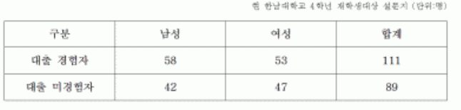
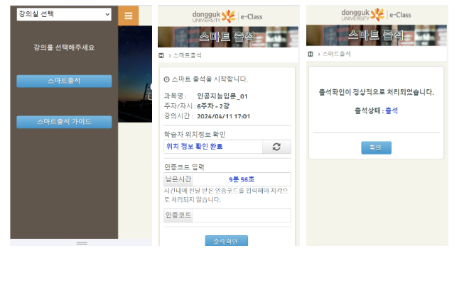
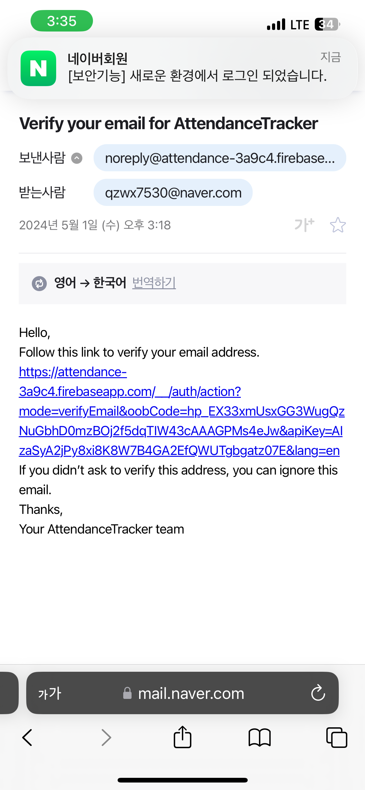
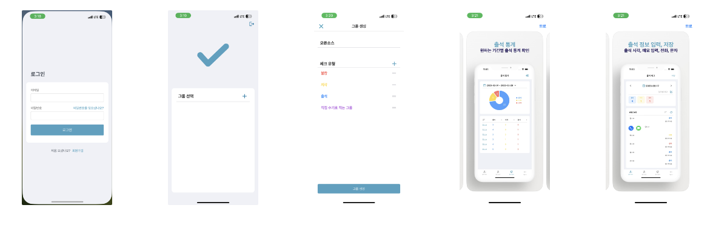

# 중간보고서

---

## **1. 프로젝트 수행팀 개요**

- 수행 학기: 2024-1
- 프로젝트명: QR 코드 스마트출석 시스템
- 팀명: 어서옵소

| 구분 | 성명   | 학번       | 소속학과         | 연계전공       | 이메일             |
| ---- | ------ | ---------- | ---------------- | -------------- | ------------------ |
| 팀장 | 장원혁 | 2018110202 | 영어통번역전공   | 융합SW연계전공 | jwhmark@gmail.com  |
| 팀원 | 김영찬 | 2019112479 | 산업시스템공학과 | 융합SW연계전공 | qzwx7530@dgu.ac.kr |
| 팀원 | 김민형 | 2019110747 | 정치외교학전공   | 융합SW연계전공 | ab000701@naver.com |

- 지도교수: SW교육원 이길섭 교수, 박효순 교수

## **2. 프로젝트 수행계획**

### **2.1 프로젝트 개요**

- 본교에서 현재 사용하고 있는 네 자리 숫자 코드를 이용한 스마트출석 시스템에는 여러 한계가 존재한다.
- 따라서 현 출석 시스템을 QR코드를 이용한 시스템으로 변경하고, 기존에 존재하는 QR코드 출석 시스템의 한계를 수정하려고 한다.
- 본 프로젝트를 통해 궁극적으로 학생과 교수자의 편의성 증진 및 신뢰성 보장을 통해 학습 환경을 개선하고자 한다.

### **2.2 추진 배경(자료조사 및 요구분석)**

### **(1) 개발 배경 및 필요성**

**1-1) 개발 배경**

대학 대리출석 현황

- **["다른 사람인거 모르겠지?"..中유학생, 수업부터 시험까지 통째 대리출석](https://n.news.naver.com/article/014/0004994892?sid=102)**
- 위 기사에서 알 수 있듯이, 중앙대 소속 중국인 유학생이 수업부터 시험까지 한 학기를 모두 대리출석을 했다는 의혹이 제기되었다.
  - 앞서 말했던 **“대리출석”**이란 수강생이 아닌, 다른 사용자가 출석하여 부정적인 방법으로 시험을 진행하고, 수업에 들어가지 않아도 출석으로 인증되는 부정적인 방법이다.

대리출석의 학습 분위기 피해

- **[“강의실 내에서 쉽게 이뤄지는 대리출석과 출튀”](https://www.dspress.org/news/articleView.html?idxno=5311)**
- 대규모 강의일수록 대리출석이 많이 발생하는데, 학습분위기에 피해를 주고, 수업을 진행하는 교수 뿐만 아니라, 학생들도 공정하지 못한 출석인증 방식으로 눈살을 찌푸리게 한다.
- 아래 사진에서 볼 수 있듯이 대출 경험자가 대출 미경험자를 뛰어넘어 많은 학생들이 대리출석을 진행하는데 경각심을 갖을 필요가 있다고 생각한다.

- 디지털 기기의 발달로, 출석이 간편해 지면서 기술적 공백이 발생하고 악의적인 사용을 막을 필요가 존재한다.

**1-1) 개발 필요성**

**<기존 서비스>**

동국대학교의 스마트 출석 시스템

- 우리 학교는 교수자가 생성한 임의의 네자리 숫자를 학생이 본인의 모바일 이클래스에서 입력하는 방식이다.

- 밴치마킹 - 장점
  - 수강생이 많은 경우, 불필요한 출석 체크 시간을 절약할 수 있음.
- 보완해야할 점 - 단점
  - 가장 큰 단점으로는 대리출석을 방지하지 못한다는 것이다.
  - 그 이유로는 위치정보 제공의 부정확성이 하나의 문제점이다. 위치정보 제공 기능이 존재하나, 대부분의 사용자가 개인정보 노출의 걱정으로 위치정보를 제공하지 않고 있다. 따라서 위치정보 제공이 되지 않아, 심지어 해외에서 출석을 인증하는 사용자도 학교 커뮤니티에서 쉽게 찾아볼 수 있다.
  - 위치정보를 제공한다고 해도, 위치정보를 정확히 강의실로 타겟을 좁히는 것이 아니라, 커다란 원을 형성하여 사용자의 위치를 특정화할 수 없고, 학교 근처 자취를 하는 사람은 집에서도 위치정보를 “인증” 상태로 출석을 진행하여 대리출석을 방지하는 기능으로서 작동하고 있지 않다.

<출석관리 서비스 - 출석체크+>

- 서비스소개
  “간편한 출석체크” 출결, 인원점검, 과제제출 등 한번에 정리
- **분석적 분석**
  - 모임 커스터마이징이 가능하여 학교, 학원, 모임 등 여러 단체 활동에서 출석 상황을 쉽게 관리할 수 있다.
- **분석기능**
  1. 회원가입 기능
     1. firebaseapp의 이메일 기반 로그인으로 사용자가 입력한 이메일에 링크가 담긴 이메일을 전송
     2. 링크 클릭시 사용자의 이메일을 아이디로 사용하여 접근 가능

1. 출석 명부를 연락처에서 가져오거나, 직접 타이핑하여 명단을 입력
   1. 프로그래밍을 활용해 사용자의 연락처와 연동하는 함수를 작성 후 사용
   2. 우리의 프로젝트 경우 리엑트로 진행할 것이기 때문에 react-native-contacts를 사용하여 사용자의 연락처와 동기화해 사용할 수 있음
2. 메모 기능
   1. 출석 일자나, 학생별로 메모할 수 있는 기능이 존재한다
3. 알림 메시지 전송 기능
   1. 모임전 미리 공지하는 알림을 보내 사용자가 까먹을 수 있는 내용을 전송해 줄 수 있다.

- 앱 사용 프로세스 및 고려해야할 점
  - 회원가입 및 그룹 생성 : 사용자가 직접 입력하여 반을 입력하고, 학생들의 정보를 입력해 출석관리를 수기로 작성할 수 있다.
  - 앱 사용 : 수기로 그룹을 만들고, 체크 유형도 만들어 모임의 출석관리를 도와주는 앱으로, 모두 수기로 작성해야한다는 점에서 불편함을 느끼는 사용자가 있다.

- 앱 자체 분석
  - 밴치마킹 - 장점
    - 직접 모임을 만들어 사용자 자유도를 증가 시킨점과 출석 통계를 보여줘 자신의 출석 현황을 한눈에 체크할 수 있는 점 그리고 메모기능을 넣어 출석 정보를 입력할 수 있다
  - 보완해야할 점
    - 출석 자동화가 되어있지 않다. 정원생들이 많아지는 경우 모두 수기로 작성해야 해 시간이 많이 소요될 수 있고, 사람이 작성하는 과정에서 실수가 발생해 출석 오류가 발생할 수 있다.

### **(2) 선행기술 및 사례 분석**
#### 1. 한국외국어대학교의 QR 출석 시스템

- 한국외대는 학생들의 접근성과 편의성을 올리기 위해 QR출석 시스템을 도입하였다. 해당 시스템은 교수가 QR코드를 요청했을 시 QR이 담긴 사이트를 제공하며, 학생들은 한국외대 앱을 사용하여 로그인하고 QR코드를 이용하여 출석한다.
- 아래 이미지는 한국외대의 실제 출석 과정이다.

- 선행 기술과의 차이

    1. QR 갱신을 통한 허위 출석 방지
    - 기존 앱은 고정된 QR코드로 강의실에 없는 학생들에게도 공유가 가능하다는 점에서 허위로 출석할 수 있다는 단점이 존재하지만 본 프로젝트에서는 네이버 로그인에서 사용하는 방식을 가져와 15초마다 QR코드를 변경하여 학생들의 허위 출석을 방지하고자 한다.
    1. 웹앱 방식 채택
    - 위 사이트는 전용 앱을 사용하도록 하여, 그 앱을 사용하지 않는 사용자들은 아예 접근이 불가능하다. 이를 보완하고자 웹앱 방식을 사용하여 휴대폰으로 웹사이트에 접근하여 출석을 할 수 있도록 개선한다.
    1. QR 플로팅 기능 구현
    - 기존 서비스는 출석체크를 진행하는 동안 화면 전체를 QR코드를 보여줘야 하며 수업을 진행할 수 없다. 본 서비스는 수업을 진행하는 동안에도 QR코드를 화면 우측 상단에 고정하여 이를 해결하고자 한다.
    1. 모임 관리 앱 확장성
    - 수업 출석 뿐만 아니라 다양한 모임에 관한 출석 관리까지 용이하게 하여 확장성을 가진 시스템을 구축한다.
      

#### 2. QR코드를 활용한 스마트폰 기반 출석 시스템(광주교육대학교 박선주)
- 방식
  - 강의실 좌석별로 QR코드를 부착하여 출석을 인증한다.
  - 강사화면
  
  
  - 수강생 화면
  
  

- 장점
  - 실시간으로 해당 과목의 수강생들의 출결현황, 피드백을 확인할 수 있다.
  - 수강생의 자리 위치를 전달받아 퀴즈 및 설문에 활용할 수 있다.
  - 출결현황은 따로 저장하여 활용 가능하다.
  - 별도 표기 없이 출석 처리가 가능하다.
- 단점
  - 개인별 출결통계와 학사 데이터베이스와의 연동이 필요하다.
  - 강의실 좌석마다 큐알코드를 설치해야한다.
  - 강사가 좌석을 직접확인 하지 않는 이상 QR코드를 미리 저장해놓고 출석을 인증하는 부정출석을 막을 수 없다.
  - 대학교 출석 시스템으로 한정된다.
  - 스마트폰 전용 앱으로 접근성이 떨어진다.

#### 4. 선행 기술 비교표

|  |         어서옵소 |         한국외대 | 광주교육대 |
| --- | --- | --- | --- |
| QR 출석 기능 |              O |              O |O|
| 출석 관리 기능 |              O |              O |O|
| 부정출석 방지 |              O |              X |X|
| 웹 접근성 |              O |              X |X|
| 플로팅 기능 |              O |              X |O|
| 확장성 |              O |              X |X|
| 장소 제약 없음|              O |              O |X|

- Github 오픈소스
  - [https://github.com/gurkanucar/jwt-project?tab=readme-ov-file](https://github.com/gurkanucar/jwt-project?tab=readme-ov-file)
    

    - 위 서비스는 Spring-Boot와 React를 사용하여 QR로그인을 구현한 오픈소스로, QR로그인 시 username과 email 주소를 서버에 전달하고, 이를 웹사이트에 전송하여 로그인을 완료하게 되면 웹사이트에 사용자의 정보를 시각화하는 사이트이다. 본 프로젝트에서는 이를 변형하여 QR 출석이 완료되면 사용자명, 기기 고유번호를 서버에 전달하여 참여자들의 출석 정보를 DB에 저장하고 이를 활용하여 출석을 정리하는 기능을 구현하고자 한다.

### **2.3 목표 및 내용**

### **(1) 개발 목표**

- 동국대학교의 스마트출석 시스템을 기존 숫자 코드 입력 방식에서 QR 코드 인식으로 교체한다.
- 사용자의 편의성을 고려하여 타임 아웃, 플로팅 기능, 기기 등록 기능을 개발한다.

### **(2) 개발 내용**

#### 1. 개발 범위

- 요구사항 명세서

| NO. <td>**사용자**</td> <td>**메뉴**</td>                        | 필요기능       | 기능설명                                                                                        |
| ---------------------------------------------------------------- | -------------- | ----------------------------------------------------------------------------------------------- |
| 1 <td rowspan="3">이용자</td> <td rowspan="2">로그인 페이지</td> | 회원가입       | 아이디, 비밀번호, 이름, 기기정보로 접속권한 등록 기능                                           |
| 2                                                                | 로그인         | 아이디, 비밀번호로 접속 기능                                                                    |
| 3 <td>마이 페이지</td>                                           | 로그아웃       | 로그아웃 기능                                                                                   |
| 4 <td rowspan="3">주최자</td> <td>모임관리 페이지</td>           | 모임생성       | 새로운 모임 생성 기능                                                                           |
| 5 <td rowspan="2">모임 상세 페이지(주최자)</td>                  | 출석 확인      | QR코드 생성으로 출석, 지각, 결석 처리 기능 출석, 지각의 제한 시간 설정 기능   플로팅 기능 |
| 6                                                                | 모임 출석 관리 | 참여자들의 출석 통계 확인 기능                                                                  |
| 7 <td rowspan="3">참여자</td> <td> 모임 소개 페이지 </td>        | 모임가입       | 새로운 모임 가입 기능                                                                           |
| 8 <td rowspan="2">모임 상세 페이지(참여자)</td>                  | 출석 인증      | 카메라로 QR코드를 스캔하여 출석 인증 기능                                                       |
| 9                                                                | 모임 출석 기록 | 날짜별 모임 출석 기록 확인 기능                                                                 |

#### 2. 최종 결과물 기능 - 유스케이스

  

  ※ 모임웹의 전체 구조이다. 실제 개발 예정인 기능은 색으로 표시되어 있다.

* 액터
    * 이용자: 모임 웹을 사용하는 사용자다.
      * 비회원: 모임 웹에 회원가입이 되지 않은 이용자다.
      * 회원: 모임 웹에 회원가입이 완료된 이용자다.
        * 주최자: 모임을 생성하고 주관하는 회원으로 모임의 관리자이다.
        * 참여자: 기존 모임에 가입하고 참여하는 회원이다.
    * 관리자: 모임 웹을 종합적으로 관리한다.
* 기능(유스케이스)
  * 회원가입
    * 비회원이 모임웹에 회원가입하는 기능이다.
    * 부정출석을 방지하기 위해 기기등록이 필수이다.
  * 로그인/로그아웃
    * 회원이 로그인/로그아웃하는 기능이다.
  * 채팅
    * 회원들 간의 소통을 위한 기능이다.
  * 설정
    * 개인 정보 변경과 기기 변경 등의 기능이다.
  * 모임 생성
    * 주최자가 새로운 모임을 생성하는 기능이다.
  * 모임 관리
    * 주최자가 모임을 관리하는 기능이다.
    * 참여자들의 출석 통계 기능이 포함된다.
    * 주최자가 모임에 대한 공지를 올리는 기능이 포함된다.
  * 출석 확인
    * 주최자가 참여자들의 출석을 확인하는 기능이다.
    * QR코드 방식으로 기능할 수 있다.
      * 플로팅 기능과 출석과 지각의 제한 시간을 선택할 수 있다.
    * 숫자코드, 수동 방식으로도 기능한다.
  * 모임 가입
    * 참여자가 새로운 모임에 가입하는 기능이다.
  * 모임 추천(AI)
    * 참여자에게 새로운 모임을 추천하는 기능이다.
  * 출석 인증
    * 참여자가 주최자가 선택한 방식으로 모임에 출석을 인증하는 기능이다.
  * 모임 기록
    * 참여자가 종료된 모임과 진행중인 모임을 기록 하는 기능이다.
      * 출석 기록을 확인할 수 있다.
      * 텍스트나 사진 형식으로 일기를 작성 할 수 있다.
      * 모임에 대한 후기를 작성할 수 있다.
* 개발범위를 고려하여 회원가입, 로그인, 모임 생성, QR코드를 통한 출석 확인, 출석 통계, 모임가입, 출석 기록, 출석 인증 기능만을 구현하는 것을 목표로 한다.

#### 3. 시스템 구조 - 블록 다이어그램

#### 4. 주요 기능 흐름 - 시퀀스 다이어그램

- 출석확인 기능(QR 생성)
  
1. 큐알 생성 요청: 주최자는 모임에 대한 큐알 코드를 생성하기 위해 클라이언트에게 요청한다.
2. 큐알 생성 요청 전송: 클라이언트는 받은 요청을 서버에 전송한다. 이때 모임 정보(ID 및 날짜)가 함께 전달된다.
3. 모임 정보 조회 요청: 서버는 받은 정보를 기반으로 데이터베이스에 모임 정보를 조회하기 위한 요청을 보낸다.
4. 모임 정보 저장 및 응답: 데이터베이스는 조회된 모임 정보를 저장하고, 이를 응답으로 서버에 전달한다. 이후 서버는 클라이언트에게 생성된 큐알 코드를 응답으로 전송한다.
5. 큐알 갱신: 부정출석을 방지하기 위해 일정 간격으로 새로운 큐알코드 생성을 서버에 요청한다. 출석 시간이 종료될 때까지 반복된다.

- 출석 인증 기능(QR 스캔)
  
1. 출석 인증 요청: 참여자가 출석을 요청하면, 클라이언트를 통해 서버에 출석 인증 요청이 전송된다.
2. 모임 출석 정보 조회: 서버는 출석이 가능한지 확인하기 위해 데이터베이스에 모임 출석 정보를 조회하는 요청을 보낸다.
3. 모임 출석 정보 응답: 데이터베이스는 조회된 모임 출석 정보를 서버에 응답한다.
4. 모임 출석 인증 가능 여부 전달: 서버는 받은 출석 정보를 기반으로 모임 출석 인증이 가능한지 여부를 클라이언트에게 전달한다.
5. 카메라 호출: 클라이언트는 출석 인증을 위해 카메라를 호출한다.
6. 큐알 코드 스캔 결과 전송: 사용자가 카메라를 사용하여 큐알 코드를 스캔하면, 클라이언트를 통해 서버에 스캔 결과가 전송된다. 이때 기기 정보와 참여자 정보가 포함된다.
7. 출석 정보 저장 및 응답: 서버는 받은 정보를 기반으로 데이터베이스에 출석 정보를 저장하고, 출석 정보에 대한 응답을 클라이언트에게 전달한다.

#### 5. 예상 최종 결과물

- 최종 결과물은 QR Login 오픈소스를 활용하여, 동국대 스마트출석의 단점을 보완하고 사용자의 편의성을 높이는 QR 출석을 구현하는 것이다.
- 최종 설계 결과물의 형태는 웹사이트 형태로 교수는 수업 컴퓨터로 접근하고, 학생들은 모바일 기기로 쉽게 접근하여 학생들의 출석을 완료하고 관리하는 웹사이트가 될 예정이다.
  - 밑의 그림은 우리가 만들고자 하는 웹사이트의 “사이트맵”으로 페이지의 구성 요소와 주요 기능을 정리하여 구조화한 그림이다.
    - 우리의 서비스는 간략하게 2가지 기능이 존재한다. 교수가 사용해야 할 기능과 학생들이 사용해야 할 기능을 나누어 개발하고자 한다.
      - 교수의 기능은 출석 QR코드를 생성하고, 출석 마감 시간을 설정하는 기능, 그리고 출석 시간이 끝나고 학생들의 출석을 관리하는 기능으로 구현하고자 한다. 이때 QR코드를 플로팅하여 수업을 진행하면서 출석을 진행할 수 있도록 구현한다.
      - 학생의 기능으로는 QR코드를 인식하여 로그인을 하고 출석 관리 페이지에 들어가 QR을 스캔하여 출석을 완료할 수 있도록 구현한다.
    - 동국대 공식 홈페이지인 동국대학교 이클래스와 연결은 동국대의 보안적인 이유로 연결하기 어렵다고 판단하여 우리의 프로젝트는 QR출석에 대한 기능을 구현하고 가상의 수업 환경을 구현하여 출석 체크를 진행하고자 한다. 추후에 기능을 모두 구현한 뒤 학교와 컨택하여 학교 홈페이지에 우리의 기능이 적용될 수 있도록 노력할 것이다.
    - 최종 설계 결과물(개발하고자 하는 설계 결과물의 최종 목표)의 형태
      - 만들고자하는 서비스의 **사이트맵** 구조도
        
      - 프로토타입
        - 주최자 측면
          
          - Client 아이디를 통해 접속하고 QR 코드 생성 요청을 전달하면 서버에서 인증 토큰이 저장되어있는 QR을 제공하여 이를 통해 QR코드 출석을 진행한다.
        - 참여자 측면
          
          - 웹사이트에 접속하여 로그인 후 개인정보를 입력하고 생성된 QR코드를 스캔하여 서버에 개인정보와 함께 전송하여 출석을 인정받을 수 있다.
- 최종 설계 결과물의 시스템 구성과 기능, 특징 등
  - 서비스 프로세스
    

    - Client(주최자)가 QR코드를 생성
    - User(참여자)은 앱에 접속하여 QR을 인식하여 QR속 수업 정보가 담긴 수업명과 인증 토큰을 받아, 서버로 전송
    - 서버는 발행한 토큰과 수업명을 비교하여 일치 여부 처리하여 db에 저장
    - 출석 마감 시간이 되면 DB에 저장된 출석data를 전송받고 출결을 처리함

#### 5. 개발 과정

- QR 출석 시스템 구현
  - QR 생성
    - Zxing 라이브러리를 활용하여 모임이름과 QR 생성 시간 정보를 담은 큐알 코드를 생성하고 url로 반환한다.
    - localhost:8090/checkattendance/qr 방문시 화면
  

    - 카메라로 스캔시 화면
    

      - 카메라로 QR 코드를 스캔하면 모임 이름과 QR코드가 생성된 시간이 나온다.

- DB 구성

  - 크게 세 개의 테이블로 구성하였으며, 각 테이블의 필드는 다음과 같다.

1. 회원 정보:
   - 필드:
     - ID (고유 식별자, Primary Key)
     - 이름
     - 아이디 (중복 방지, Unique Key)
     - 비밀번호
     - 전화번호
     - 이메일
     - 기기 고유 식별자
2. 모임 정보:
   - 필드:
     - ID (고유 식별자, Primary Key)
     - 모임 이름
     - 주최자 ID (회원 정보 테이블의 외래 키, ID 참조)
     - 참여자 ID (회원 정보 테이블의 외래 키, ID 참조)
     - 진행 일시
3. 출석 정보:
   - 필드:
     - ID (고유 식별자, Primary Key)
     - 회원 ID (회원 정보 테이블의 외래 키, ID 참조)
     - 모임 ID (모임 정보 테이블의 외래 키, ID 참조)
     - 진행 일시
     - 출석 여부 (예: 출석, 지각, 결석 등)

- 프론트엔드 사이트 구현

### **(3) 설계의 현실적 제한요소(제약조건)**

- **이클래스 시스템과의 통합 제한**

  - 동국대학교의 이클래스 시스템은 메디오피아의 자체 개발 LMS 솔루션을 기반으로 하기 때문에 이클래스 시스템과 QR 코드 로그인 시스템의 완전한 통합은 제한되어 우리의 서비스와 연동하기에 어려움이 존재한다. 우리는 위의 제약조건을 고려하여 독립적인 서비스를 개발하고 추후에 우리의 서비스를 추가 개발하여 사용할 수 있도록 구현하고자 한다.

- **예산 제한**

  - 프로젝트에서 예산이 책정되지 않았기 때문에 필요한 소프트웨어 라이선스, 서버 구매, 개발 도구 등의 비용을 확보하기 어렵다. 따라서 유료 시스템의 경우 필요한 기술적 자원을 확보하는 데 어려움이 있다. 이 제약조건을 고려하여 최대한 오픈소스를 를 이용하고 무료로 배포된 범위에서의 개발 환경을 이용한다.

- **시간 제한**
  - 프로젝트 종료 기한이 정해져 있기 때문에 개발, 테스트, 및 배포에 대한 일정이 제한된다. 모든 기능을 구현할 경우 충분한 테스트와 검증이 부족하여 시스템의 품질 저하가 있을 수 있다. 따라서 개발 범위를 조정하여 QR 코드 출석기능을 중심으로 하여 주요 기능만을 구현할 예정이다.

### **(4) 대안 도출**

- **프로젝트 구현 범위**

  - 본 프로젝트의 최초 설계 목적인 동국대학교 출석 시스템과의 통합은 동국대학교가 기업의 자체 개발 LMS 솔루션을 이용함에 따라 제한된다. 이에 따라 세 가지의 대안이 제시된다.

  #### 1. 대안비교

  ##### 대안1) 동국대학교 출석시스템

  - 자체 웹에 사용자의 동국대 이클래스의 아이디와 비밀번호를 입력하게 하여 동국대 이클래스와 연동을 구현한다. 이는 자체 웹에 입력된 정보를 동국대 이클래스에 전달하여 로그인을 하는 형태위위 출석을 인증하는 형태이다. 이 대안은 실제 출석 기능이 구현되어 최초의 설계 목적을 달성하고 동국대학교 구성원들에게 실용성이 있는 웹이 될 수 있다. 하지만, 연동을 구현하는 과정이 복잡하고 교수자 권한으로의 이클래스 접근은 제한되기 때문에 개발의 어려움이 있다. 또한, 개인 정보를 이클래스에 전달하는 과정에서 정보가 유출되는 등의 보안 문제가 발생할 수 있다.

  ##### 대안2) 가상대학 출석시스템

  - 가상의 동국대학교 사용자를 대상으로 웹을 개발한다. 이는 앞선 대안의 보안 문제가 발생하지 않고 개발 범위를 좁힐 수 있어 보다 개발이 용이하다는 장점이 있다. 하지만, 가상의 사용자 데이터베이스와 가상의 강의 정보를 이용한 웹은 실용성이 떨어지는 문제가 발생한다.

  ##### 대안3) 모임 출석 시스템

  - 특정 출석 시스템에 귀속되지 않고 다양한 모임을 대상으로 하는 웹을 개발한다. 이 대안은 모든 모임을 대상으로 하는 범용성에 대한 요구로 제시되었다. 이는 동국대학교 출석시스템과 연동할 필요가 없으므로 개발의 복잡성을 낮춰주지만 가상의 정보를 이용하는 대신 실제 모임 정보를 등록할 수 있게 함으로써 실용성을 보장한다. 또한, 특정 출석 시스템에 귀속되지 않고 다양한 모임을 등록할 수 있게 하고 학생과 교수자의 구분 없이 이용 가능하여 범용성이 증가한다.

  #### 2. 선택된 솔루션

  - 세번째 대안인 모임 출석 시스템은 기존 대안보다 범용성과 실용성이 높고, 개발의 복잡성이 낮고 보안 문제 발생 가능성이 낮다. 또한, 이러한 방식으로 개발했을 경우, 학교뿐만 아니라 다양한 모임에서 출석을 인증해야하는 단체에서 손쉽게 사용자의 출석을 정확하게 인증할 수 있다. 따라서, QR 코드를 통해 등록된 모임의 출석을 확인하는 웹을 개발하는 대안3을 최종솔루션 선택하였다.

* **QR코드 생성 방식**

  #### 1. 대안비교

  ##### 대안1) 프론트엔드에서 QR코드 생성

  - 프론트엔드 차원에서 qrcode.js, QRious, React QR Code 등의 라이브러리를 통해 QR 코드를 생성할 수 있다. 프론트엔드에서 QR 코드를 동적으로 생성하여 서버와의 의존성 줄일 수 있지만, 클라이언트 측 보안 취약성, QR 코드 생성 로직 관리가 어렵다.

  ##### 대안1) 백엔드에서 QR코드 생성\*\*

  - 백엔드 차원에서 ZXing, pyqrcode 등의 라이브러리를 통해 QR 코드를 생성할 수 있다. 프론트엔드에서 QR코드를 생성하는 것보다 보안 및 안정성이 높다. 또한, 중앙 집중적으로 QR 코드를 생성하고 관리가 가능하다. 클라이언트-서버 간의 네트워크 통신 필요하고 일부 지연이 발생할 수 있다.

  #### 2. 선택된 솔루션

  - 백엔드에서 QR 코드를 생성하고 관리하는 것이 보안과 안정성 측면에서 유리하다. 또한, 프론트엔드와 백엔드의 역할 구분을 위해 백엔드에서의 QR 코드를 생성하는 대안 2를 선택하였다.

* **QR코드 라이브러리**

  #### 1. 대안비교

  ##### 대안1) ZXing

  - 자바로 개발된 QR 코드 생성을 위한 라이브러리로, QR 코드 이외에도 바코드 및 2차원 코드의 다양한 형식을 지원한다. QR 코드의 크기와 색상 등을 조절하는 등 다양한 설정 옵션을 제공하고 높은 정확도와 성능을 가진다. 다양한 언어로 이식이 가능하여 웹 앱에서 주로 사용된다.

  ##### 대안2) PyQRCode

  - 파이썬에서 QR 코드를 생성하는 라이브러리다. 사용법이 간단하고 파이썬 생태계와의 통합이 유연하다. Zxing보다 설정 옵션이 적다. 대용량 데이터를 처리하는 것에 있어서 자바를 사용하는 경우보다 실행 속도가 느리다.

  #### 2. 선택된 솔루션

  - 백엔드 개발자들의 주언어가 자바이고, Zxing이 웹 개발에 더 유리하기 때문에 대안 1을 최종적으로 선택하였다.

### **(5) 구현 계획**

- QR 코드 생성 모듈 구현
  - 백엔드에서 Zxing 라이브러리를 사용하여 QR 코드 생성을 위한 모듈을 개발할 것이다. QR 코드 생성 요구를 받으면 QR 코드를 생성하고 이미지 형태로 클라이언트에 응답 후 생성한 이미지를 프론트엔드 게이트웨이에 전달하여 클라이언트의 요청에 대답하는 형식으로 기능을 구현할 예정이다.
- 학생 중복 방지 모듈 구현
  - 서버에 전송 시에 휴대전화의 Advertising ID(광고 식별자)를 함께 전송하여, 학생의 핸드폰이 무엇인지 구별하고, 한 학생들의 응답이 중복되어 일명 “대리 출석”을 방지하는 기능을 구현하고자 한다. 이는 안드로이드의 경우 안드로이드 API를 활용하여 개개인의 Advertsing ID를 서버로 전송하고 IOS의 경우 UIKit 라이브러리를 사용하여 Advertsing ID를 서버로 전송하여 구별하고자 한다.
- 데이터 정의

  - 회원 정보: 계정을 생성하기 위해서 아이디와 비밀번호, 이름이 기본적으로 필요하다. 대리 출석을 방지하기 위해 등록할 단일 기기 정보가 필요하다.
  - 모임 정보: 모임 이름과 주최자, 참여자 정보가 필요하다.
  - 출석 기록: 앞서 정의된 모임 정보의 데이터와 출석 일시, 출석 기준 등의 데이터가 필요하다.

- **플로 차트**

### **(6) 개발 환경**

- 하드웨어 장비

  - Macbook Pro 14
    - CPU: Apple M3
    - RAM: 16GB
    - 저장장치: Macintosh HD / 512GB
    - 운영체제: macOS Sonoma 14.2
  - LG전자 LG그램 360 14TD90Q-GX5GK
    - CPU: 인텔/코어i5-12세대
    - RAM: 16GB
    - 저장장치: M.2(NVMe)/512GB
    - 운영체제: Windows 11 Edu

- 소프트웨어 사용 기술
  - Frontend
    - HTML, CSS, Javascript를 사용해 웹 페이지 구성 및 동작하도록 구현할 것이다.
    - React를 사용해 사용자 인터페이스(UI) 개발할 것이다.
  - Backend
    - Java 기반의 백엔드 프레임워크인 Spring boot를 사용해 백엔드 로직을 구현하고 웹 애플리케이션을 개발할 예정이다.
    - 데이터의 구조화된 쿼리와 처리를 위해 MySQL를 사용하여 개발할 것이다.
  - Server
    - 웹 호스팅 서비스를 운영하기 위해서 AWS의 EC2 인스턴스를 이용하여 웹 서버를 운영할 예정
  - CI/CD 선택
    - Jenkins와 GitHub Actions 중 CI/CD를 어떤 선택할지 의견이 나뉘었다. Jenkins로 CI/CD를 구축를 생각하였지만, 서버를 따로 두어야 하고 설정을 따로 해줘야 하기 때문에, 이번 팀프로젝트 규모에는 사용하기 적절하지 않다고 판단하여 GitHub Actions를 사용하기로 결정하였다.
  - architecture
    

### **2.4 기대효과**

1. 편의성 증진

- 참여자의 출석 인증 과정의 편의성을 증진한다. QR 코드를 이용한 스마트출석 시스템은 참여자들이 카메라로 QR 코드를 스캔하는 동작 하나로 출석을 인증한다. 이는 기존 숫자 코드 입력에서 발생할 수 있는 잘못된 입력의 가능성을 차단하고, 숫자를 입력하는 동작을 줄여준다.

2. 부정출석 방지

- 부정 출석을 방지하여 주최자와 참여자의 신뢰성을 보장한다. 참여자의 기기 등록 기능과 QR코드의 타임 아웃 기능을 통해 부정 출석을 방지할 수 있다. 이는 주최자들이 참여자의 모임 출석 상태를 정확하게 파악하게 할 뿐만 아니라 부정 출석 가능성으로 발생할 수 있는 주최자와 참여자 간의 신뢰성을 회복한다.

3. 안정적 모임 진행

- 모임의 안정적 진행을 보장하여 모임의 환경을 개선한다. 본 프로젝트의 플로팅 기능을 통한 출석 체크는 지각으로 인해 모임 진행이 방해되는 것을 방지한다. 이는 주최자들과 참여자의 모임 만족도 증가로 이어질 수 있다.

4. 다양한 모임 관리

- QR 코드 스마트출석 시스템 회원들의 다양한 모임 관리를 용이하게 한다. 학교와 같은 특정 출석 시스템에 귀속되어 있지 않기 때문에 하나의 시스템으로 개인의 다양한 모임을 포괄하여 출석을 관리할 수 있다.

5. 종합적 모임 관리 플랫폼으로의 발전 가능성

- 본 프로젝트 이후 추가 개발 과정을 통해 종합적인 모임 플랫폼으로의 발전 가능성이 있다. 일정 관리 시스템의 추가 개발이나 다양한 출석 방식의 도입, 기존 시스템과 연동 등으로 출석 시스템의 한계를 벗어나 종합적인 모임 관리 플랫폼으로의 발전이 기대된다.

### **2.5 추진일정**

### **2.6 참고문헌**

1. 한국외대 전자출결 관리 시스템 메뉴얼, [https://at2.hufs.ac.kr/guide.html](https://at2.hufs.ac.kr/guide.html)
2. QR코드를활용한스마트폰기반출석체크시스템, 박선주

### **2.7 성과창출 계획**

| 항목        | 세부내용                               | 예상(달성)시기 |
| ----------- | -------------------------------------- | -------------- |
| Github 등록 | QR코드 스마트출석 웹 개발 내용 및 과정 | 2024.06        |
